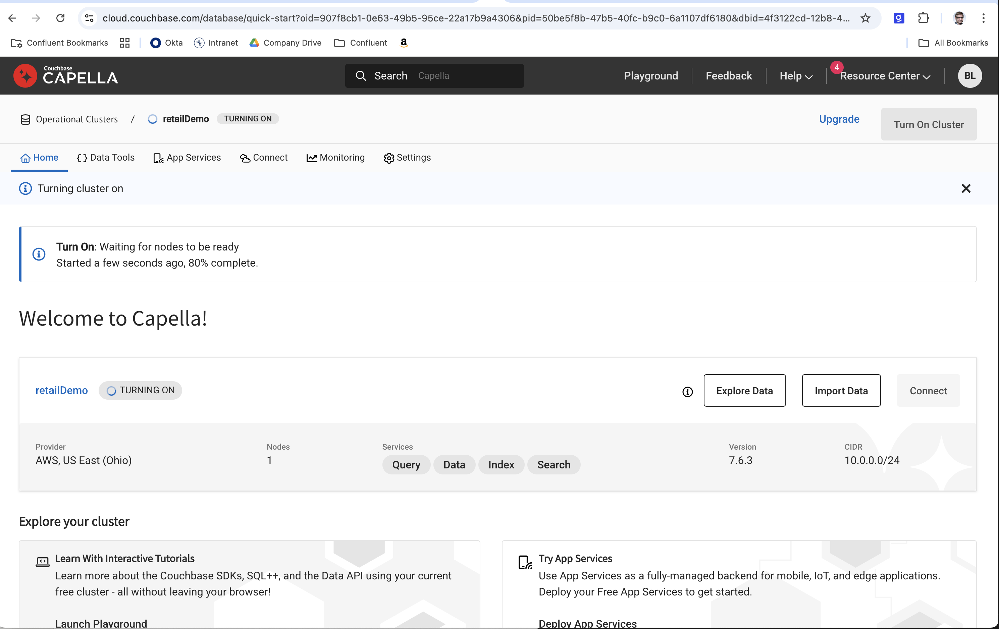

# Couchbase Capella Vector Search

I started by going to [https://cloud.couchbase.com/](https://cloud.couchbase.com/) and logged in with my google account.  I created a free tier instance and once it was ready to use I followed the steps below in the video to get it set up.  In the mean time, while I wanted for it to be provisioned, I installed a custom connector for couch base in the confluent cloud.


|Complete Walkthrough For Connecting to Couchbase|    
|---------------------------|   
|[Click here to watch a video on creating a capella instance and updating the connector in Counfluent Cloud.](https://youtu.be/uYxm7Yg7rgo)|   
|<a href="https://youtu.be/uYxm7Yg7rgo" target="video"></a>|

```json
{
    "confluent.custom.schema.registry.auto":"true",
    "couchbase.bucket":"confluent",
    "couchbase.enable.tls":"true",
    "couchbase.password":"Password1$",
    "couchbase.seed.nodes":"couchbases://cb.gdmqo64s1yetoahc.cloud.couchbase.com",
    "couchbase.topic.to.collection":"product-vector=demo.product-vector",
    "couchbase.username":"confluent",
    "key.converter":"io.confluent.connect.json.JsonSchemaConverter",
    "topics":"product-vector",
    "value.converter":"io.confluent.connect.json.JsonSchemaConverter"
}
```
